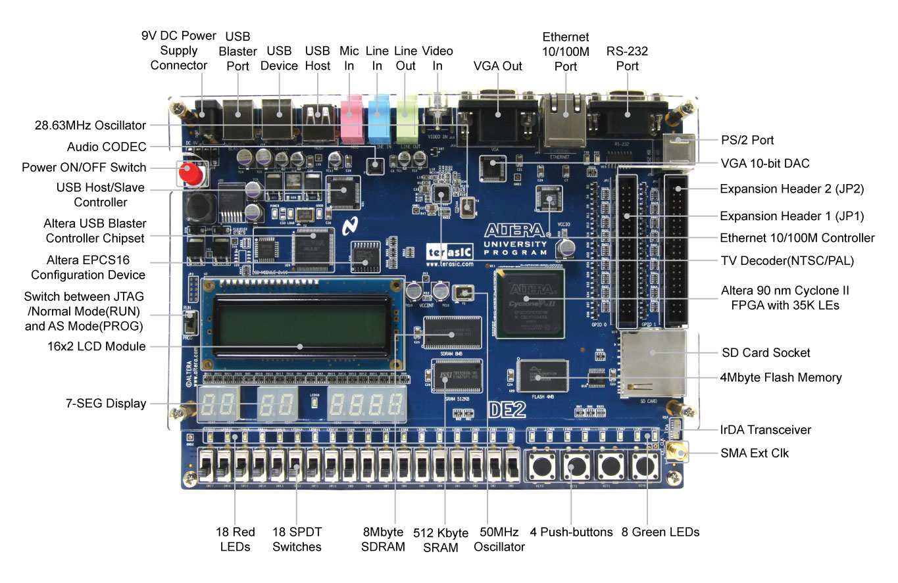

# Apple One Terasic DE2 Board target

Maintainer: Jac Goudsmit https://github.com/JacGoudsmit

Based on Terasic DE0 version by Niels Moseley https://github.com/trcwm

### Build environment
The project was developed using Quartus II Web Edition, version 13.0sp1 (free). Altera (now Intel) discontinued support for the Cyclone II after that version.

### Features
* UART support via the on-board RS-232 interface.
* VGA support via the on-board VGA connector.
* PS/2 keyboard support via the on-board PS/2 connector.
* The 7-segment display shows the 6502's program counter.
* The right-most push button resets the system.

### Differences from the DE0 version
* The serial port doesn't have a CTS output